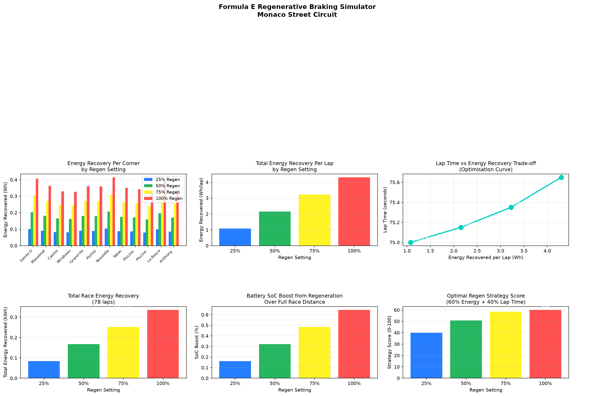

# Formula E Regenerative Braking Simulator

A Python simulation that models energy recovery through regenerative 
braking at each corner of the Monaco Street Circuit, optimising regen 
settings to balance energy recovery against lap time penalty.

## What it does

This script simulates four regenerative braking settings (25%, 50%, 75%, 
100%) across all 12 corners of the Monaco circuit and produces six charts:

- Energy recovery per corner — which corners offer the most regen opportunity
- Total energy recovery per lap — how each regen setting compares
- Lap time vs energy trade-off — the optimisation curve showing the 
  strategic balance between energy recovery and pace
- Total race energy recovered — cumulative recovery over 78 race laps
- Battery SoC boost — how much battery percentage regen restores
- Optimal strategy score — weighted scoring of each regen setting

## Circuit Parameters

- Circuit: Monaco Street Circuit (12 corners modelled)
- Race Distance: 78 laps
- Car Mass: 900 kg (Formula E Gen3 + driver)
- Max Regen Power: 350 kW
- Battery Capacity: 52 kWh

## Example Output

The simulation shows 75% regen as the optimal strategy at Monaco — 
recovering significantly more energy than 25% or 50% settings while 
avoiding the severe lap time penalty of 100% regen. The lap time vs 
energy trade-off curve reveals a clear diminishing returns point beyond 
75%, making it the strategically optimal setting for race conditions.

## Tech Stack

- Python
- Matplotlib — simulation dashboard
- NumPy — physics calculations
- Pandas — corner data handling

## How to Run

1. Install dependencies: `pip install matplotlib numpy pandas`
2. Run the script: `python regen_braking.py`
3. Dashboard will display and save as `regen_braking.png`

## Why This Project

Regenerative braking strategy is one of the most critical decisions in 
Formula E. Too much regen slows the car; too little wastes recoverable 
energy. Finding the optimal setting per corner and per circuit is a 
core task for Formula E energy engineers — this simulation builds the 
quantitative foundation for those decisions.

## Author

Hamna Shahzad — Electrical Engineering Student | Aspiring Motorsport Engineer
